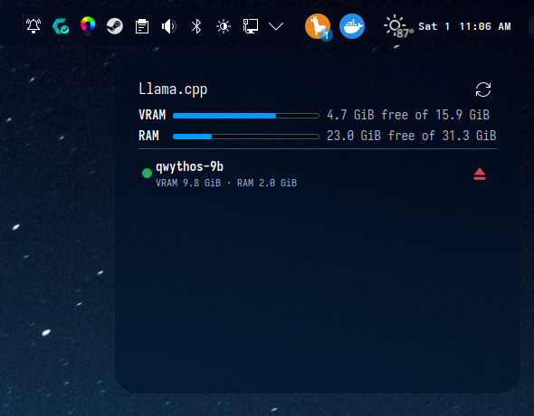
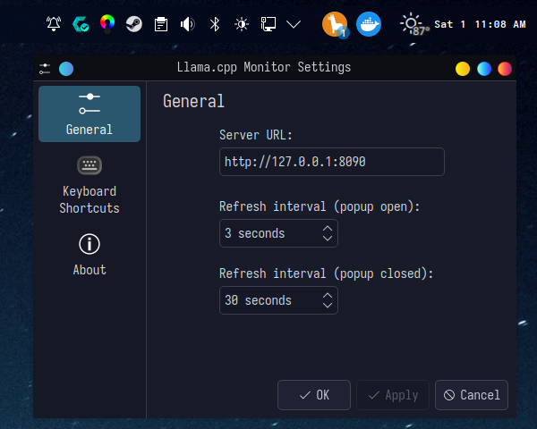

# 🦙 Llama.cpp Monitor

         

## ✨ Overview

Monitor and manage llama.cpp models served through [llama-swap](https://github.com/mostlygeek/llama-swap) directly from your KDE Plasma 6 panel. Get real-time visibility into VRAM and RAM usage with an intuitive round panel icon.

  
***Popup with detailed memory usage and model unload button***

  
***Widget configuration***

## 🎯 Features

### 📊 Real-time Monitoring
- **Round Panel Icon** with badge showing loaded model count
- **Popup Display** shows VRAM/total VRAM and RAM/total RAM usage
- **Per-model Memory Footprint** with loading/ready status
- **Live Updates** with configurable refresh intervals

### 🧹 Memory Management
- **Easy Unload Buttons** for each loaded model
- **Automatic RAM/VRAM Cleanup** via process attributes
- **Granular Memory Attribution** from `llama-server` process

### ⚙️ Customization
- **Server URL Configuration** (default: `http://127.0.0.1:8090`)
- **Adjustable Refresh Intervals** for popup and closed states
- **Works with or without AMD GPU** (VRAM still displayed when available)

## 📋 Requirements

### Minimum Requirements
- **Desktop Environment**: KDE Plasma 6
- **Core Dependencies**: llama-swap, curl
- **Hardware**:
  - AMD GPU for VRAM metrics (optional - works without one)
  - Requires `/sys/class/drm/card*/device/mem_info_vram_*` access
- **Permissions**: Read access to system memory files

### Optional Dependencies
- `jq` - For better JSON parsing (recommended)
- `notify-send` - For desktop notifications (optional)

## 🚀 Installation

### Quick Install

```bash
# Install or upgrade
./install.sh

# Uninstall
./install.sh remove
```

### Development Install

```bash
# Clone repository
git clone <repository-url>
cd llamacppmon-kde

# Install development dependencies
./install.sh dev

# Run tests
./run-tests.sh
```

### Setup Instructions

1. **Install llama-swap** if you haven't already
2. **Run the install script** to install the monitor
3. **Add Widget** from the panel's *Add Widgets* menu
4. **Configure Settings** by right-clicking the icon

## ⚙️ Configuration

### Configuration Options

**Right-click the icon → Configure…**

#### Server Settings
- **Server URL** — llama-swap base URL (default: `http://127.0.0.1:8090`)
- **API Endpoint** — llama-swap API path (default: `/api/models`)

#### Refresh Intervals
- **Refresh interval (popup open)** — default: 3 seconds
- **Refresh interval (popup closed)** — badge/tooltip polling, default: 30 seconds

#### Display Options
- **Show VRAM** — Display VRAM usage (default: enabled)
- **Show RAM** — Display RAM usage (default: enabled)
- **Compact Mode** — Show only essential info (default: disabled)

## 🔧 Troubleshooting

### Common Issues

#### 🔴 Icon Not Appear
- **Check if llama-swap is running**: `curl http://127.0.0.1:8090/api/models`
- **Verify Plasma 6 version**: `plasmashell --version`
- **Check permissions**: Verify access to `/sys/class/drm/card*/device/mem_info_vram_*`

#### 🟡 VRAM Not Displaying
- **AMD GPU not detected**: Verify GPU is recognized: `lspci | grep -i vga`
- **Permission denied**: Check if process has access to VRAM files
- **llama-swap not using GPU**: Check llama-swap configuration

#### 🟢 High Memory Usage
- **Too many models loaded**: Consider using smaller models or unloading unused ones
- **Refresh interval too fast**: Increase the refresh interval in settings
- **Process cleanup**: Monitor memory cleanup in llama-swap logs

#### 🔵 Popup Not Updating
- **Network connectivity**: Verify server URL is reachable
- **API changes**: Check if llama-swap API has been updated
- **Refresh interval**: Adjust the popup refresh interval

### Getting Help

#### Debug Mode
```bash
# Enable verbose output
./install.sh dev
```

#### Log Files
- **System logs**: `journalctl -xe`
- **Application logs**: Check the plasmoid output
- **llama-swap logs**: `journalctl -u llama-swap`

#### Community Support
- **GitHub Issues**: [Open an issue](https://github.com/danielmdecker/llamacppmon-kde/issues)
- **Discussions**: [Join discussions](https://github.com/danielmdecker/llamacppmon-kde/discussions)
- **KDE Forums**: [KDE Plasma forums](https://discuss.kde.org/)

## 💡 Tips & Tricks

### 🎯 Best Practices
- **Regular Monitoring**: Check memory usage periodically during heavy usage
- **Model Management**: Unload models when not actively using them
- **Refresh Optimization**: Adjust refresh intervals based on your needs
- **GPU Utilization**: Monitor GPU usage alongside VRAM for better performance

### 🚀 Performance Tips
- **Lower Refresh Rates**: Use longer refresh intervals when not actively monitoring
- **Model Selection**: Choose appropriate model sizes for your available VRAM
- **Background Processes**: Minimize other GPU-intensive applications
- **System Resources**: Ensure enough RAM for model swapping

### 🔧 Advanced Configuration
- **Custom API Endpoints**: Modify the server URL if using a proxy
- **Script Integration**: Create custom scripts to interact with the monitor
- **Automated Unloading**: Use system timers to unload unused models
- **Memory Limits**: Set limits in llama-swap to prevent out-of-memory scenarios

## 📝 Changelog

### Version 1.0.0 (2024-01-01)
- Initial release
- Basic model monitoring functionality
- VRAM and RAM usage display
- Popup interface with model management
- Configuration options for customization

### Version 0.9.0 (2023-12-15)
- Beta testing phase
- Early access to KDE Plasma 6 support
- Memory management improvements

### Version 0.8.0 (2023-11-01)
- Alpha release
- Basic functionality testing
- Early UI development

## 🔨 Development

```bash
# Clone repository
git clone https://github.com/danielmdecker/llamacppmon-kde.git

# Install development dependencies
./install.sh dev

# Run tests
./run-tests.sh

# Build for development
mkdir -p build
cd build
cmake ..
make

# Run in development mode
./llamacppmon-kde
```

### Project Structure
```
llamacppmon-kde/
├── plasmoid/           # Main plasmoid package
│   ├── contents/
│   │   ├── code/      # Main plasmoid code
│   │   ├── config/    # Configuration files
│   │   └── layouts/   # UI layouts
│   └── metadata.json  # Plasmoid metadata
├── tests/             # Test suite
├── docs/              # Documentation
├── install.sh         # Installation script
├── run-tests.sh       # Test runner
└── README.md          # This file
```

### Development Guidelines
- Follow KDE coding standards
- Test on multiple Plasma 6 versions
- Ensure backward compatibility
- Write comprehensive tests
- Document all changes

## 📄 License

This project is licensed under the MIT License - see the [LICENSE](LICENSE) file for details.

## 🤝 Contributing

Contributions are welcome! Please feel free to submit a Pull Request.

### How to Contribute
1. Fork the repository
2. Create your feature branch (`git checkout -b feature/amazing-feature`)
3. Commit your changes (`git commit -m 'Add amazing feature'`)
4. Push to the branch (`git push origin feature/amazing-feature`)
5. Open a Pull Request

### Code of Conduct
Please be respectful and constructive in all interactions.

## 📧 Contact

- **Author**: Daniel M. Decker
- **Repository**: [llamacppmon-kde](https://github.com/danielmdecker/llamacppmon-kde)
- **Issues**: [Open an issue](https://github.com/danielmdecker/llamacppmon-kde/issues)
- **Email**: [your-email@example.com](mailto:your-email@example.com)

## 🙏 Acknowledgments

- [llama-swap](https://github.com/mostlygeek/llama-swap) - For the llama.cpp implementation
- [KDE Plasma](https://kde.org/) - For the beautiful desktop environment
- The KDE community for continuous support and feedback
- All contributors and testers for their valuable feedback

## 📊 Statistics


---

Made with ❤️ for the KDE community
  
[⬆ Back to Top](#llamacpp-monitor)

